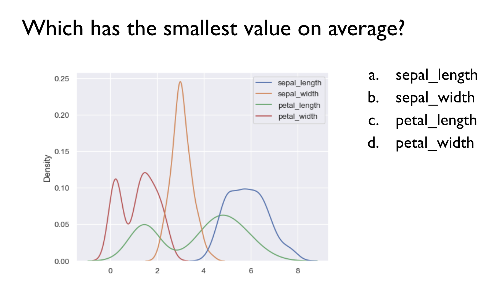
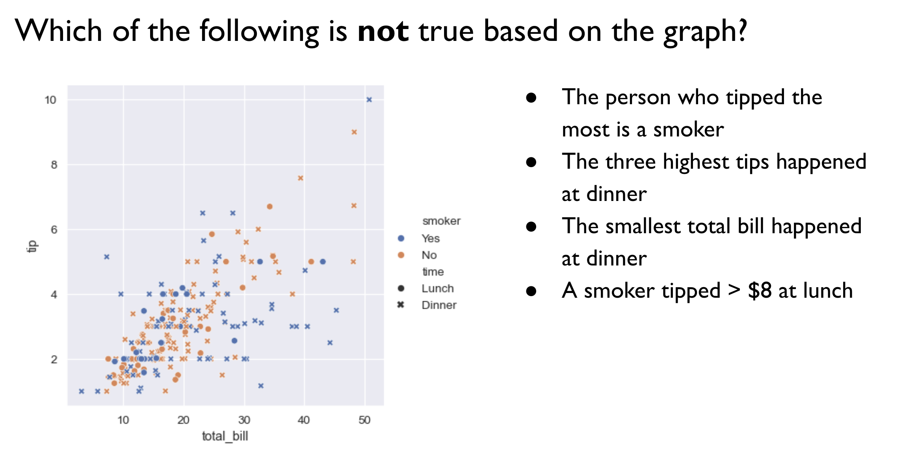
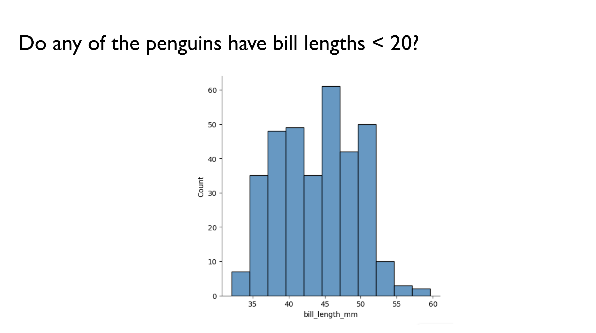
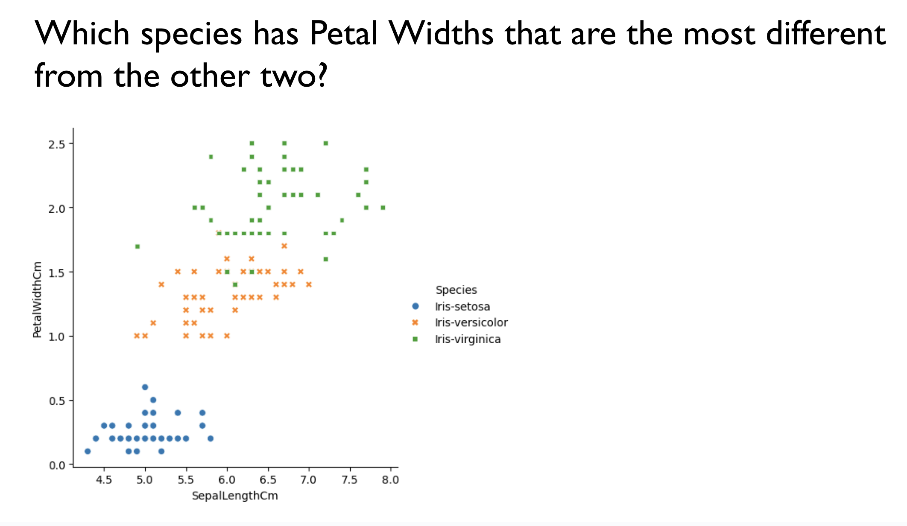
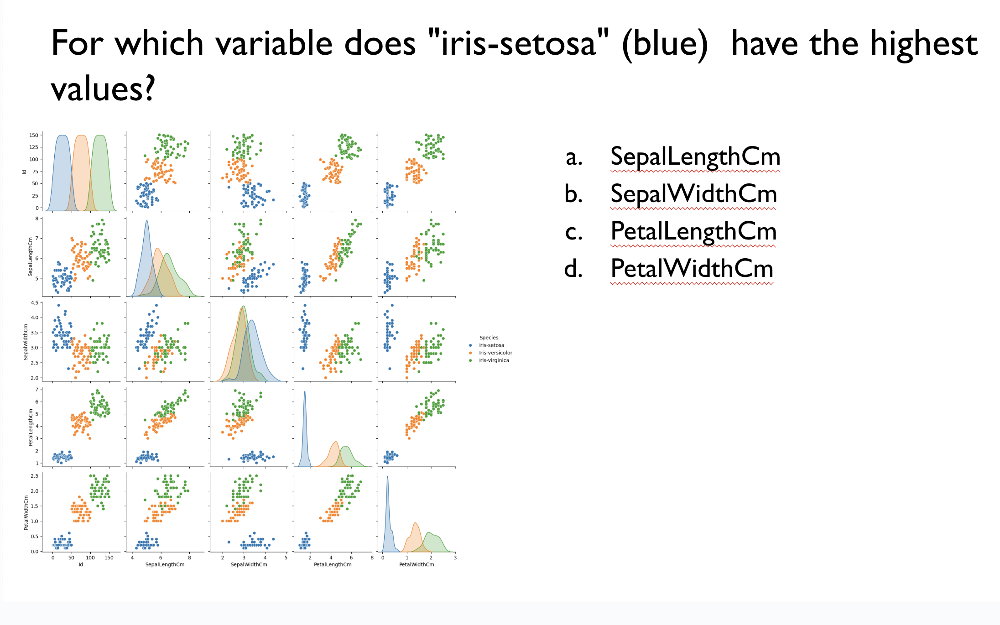

# Lab 9

## Aggregation

| Function | Description |
|--|--|
| `.mean()` | Average |
| `.sum()`  | Sum total | 
| `.count()` | Number of non-null values |
| `min()` | Smallest value |
| `max()` | Largest value |
| `median()` | Median value |
| `.std()` | Standard deviation | 
| `.var()` | Variance | 
| `.nunique()`  | The number of unique values |

### Code from class:

```
# pairplot
sns.pairplot(penguins, hue = "species")

# mean body mass of each species
penguins.groupby("species")["body_mass_g"].mean()

# median body mass from each island
penguins.groupby("island")["body_mass_g"].median()

# minimum body mass by sex
penguins.groupby("sex")["body_mass_g"].min()

# plotting result
grouped_result = penguins.groupby("species")["body_mass_g"].median()
sns.barplot(grouped_result)
```

## Part 1: Plot interpretation questions
Answer the following plot interpretation questions.

1. 


2. 


3. 


4. 


5. 


## Part 2: Data analysis questions

1. Download this bikesharing data:
   * `bikesharing.csv`: [https://drive.google.com/file/d/1r_5a9odlnxs1DGPbvWP-s8hsdxOWBO14/view?usp=sharing](https://drive.google.com/file/d/1O32iI5wnlsNWNyuXuE0QhmSP-X6u5p3N/view?usp=sharing)
   * `monthly_info.csv`: https://drive.google.com/file/d/1GBJ3QyVpE31v8kPWCL-4epPFRThrpuL9/view?usp=sharing
     
2. Load these two dataframes into pandas and join them, saving the result as a new variable.  What columns should you merge on? What kind of merge should you use?
   
4. Change the type of the `date`  and `date_noyear` to datetime objects using the following lines of code (replace `df`  with the name of your dataframe):
   
```
df['date'] = pd.to_datetime(df['date'])
df['date_noyear'] = pd.to_datetime(df['date_noyear'])
```

Note: this allows Python to interpret these columns as dates rather than strings, which improves plotting.

5. Make a pairplot for this merged data. Which two variables have the strongest linear relationship (as one variable increases, the other tends to increase)?
   
6. Find the median number of *casual* riders per weekday (group by weekday, and find the average of `casual`). Which weekdays are most popular for casual riders?
   
7. Make a bar plot of the median number of casual riders per weekday.
   
8. Find the median number of *registered* riders per weekday (group by weekday, and find the average of `registered`). Which weekdays are most popular for registered riders?
    
9. Find the date with the minimum number of riders. Look up this date. Why do you think there were so few bike riders?
    
10. Use `sns.relplot()` to make a plot with this data. You can use additional arguments to try to make as interesting/informative of a plot as possible.
    
11. What can you learn from the plot you created?
    
12. Use `sns.catplot()` to make a plot with this data. You can use additional arguments to try to make as interesting/informative of a plot as possible.
    
13. What can you learn from the plot you created?


